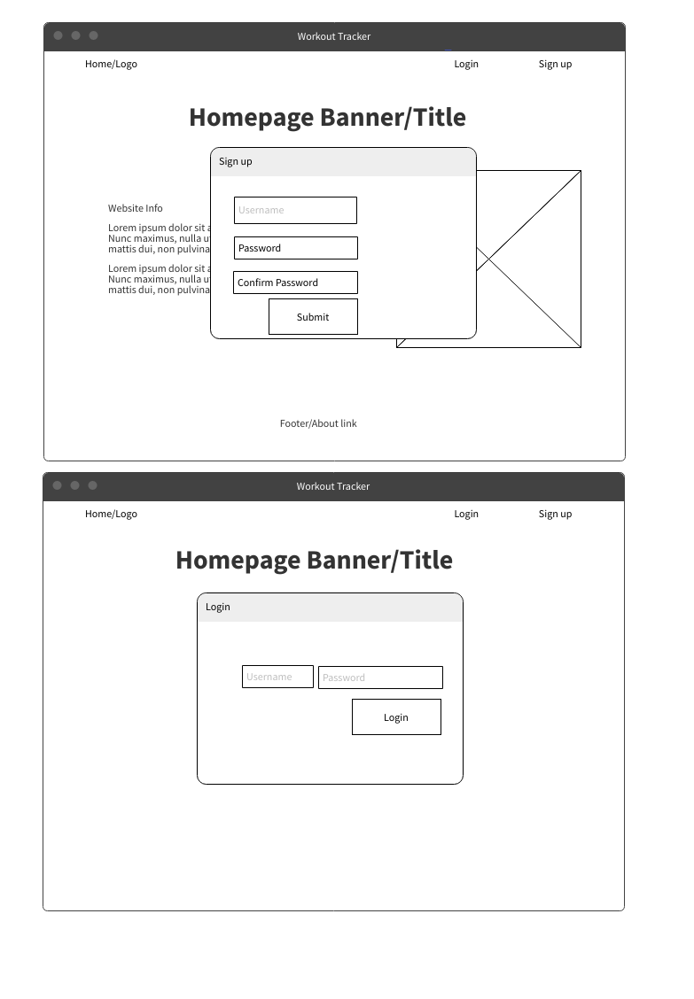
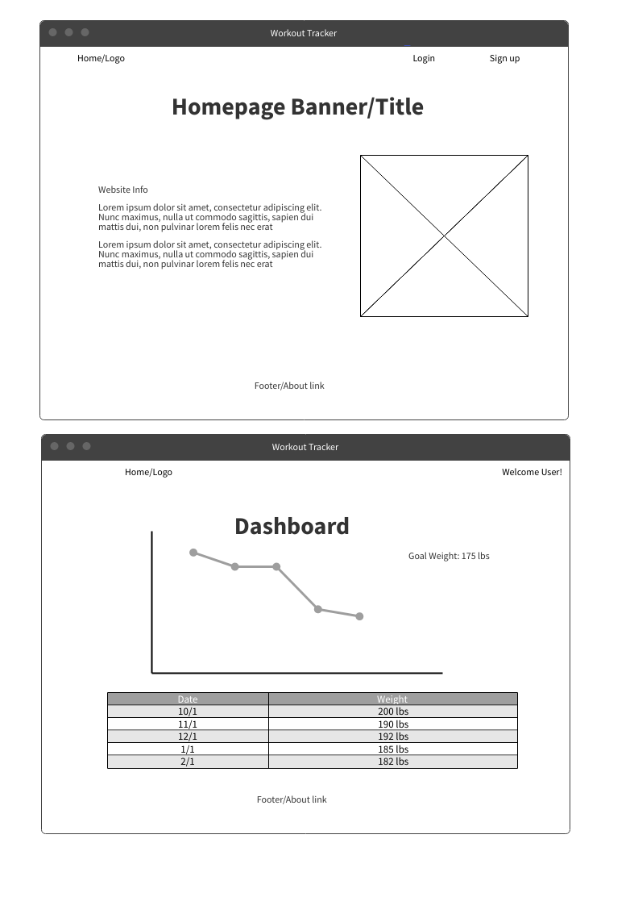
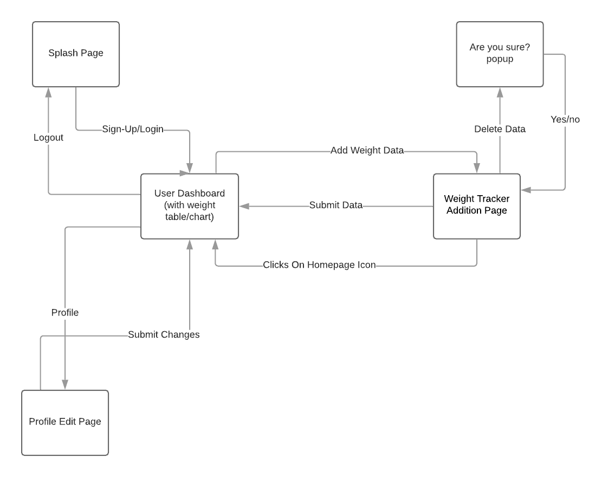
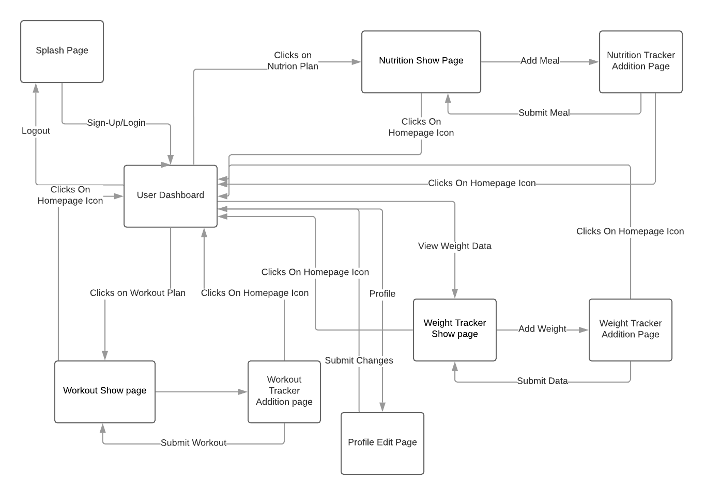
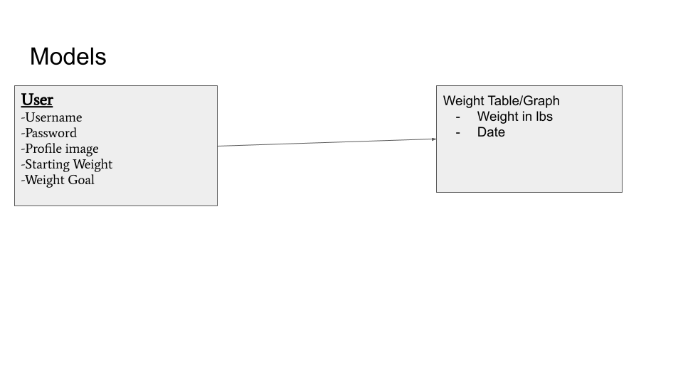
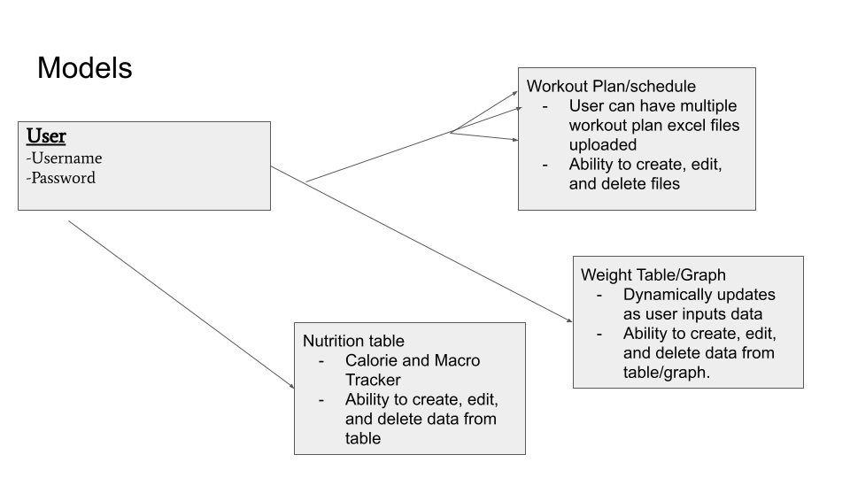

# Fitness-Tracker

Fitness-Tracker is a web application catered to users who want to keep track of their weight loss/gain progress, nutrition plans, and workout plans all in one place.

=== User Stories ===

The landing page will provide users with a description of the application and prompt them to sign up or login if they have an account.

Once logged in, users will be directed to a dashboard where their weight can be inputed into a table with a dynamically updating graph to visualize the change. 

Users will be able to create, update, and delete their weight data when logged in to their account.

=== Stretch Goals ===

Users will be able to track workout plans from their Dashboard as well as use a nutrition calculator to keep track of calorie intake.

=== Wireframes ===

- Login and Sign-up Pages

- Splash Page and Dashboard

=== User Flow MVP ===

=== User FLow Stretch ===

=== ERD MVP ===

=== ERD Stretch ===

# Milestones

=== Sprint 1: 9/10 ===

- Create Routes

- Create Skeleton of Dashboard and Splash Page

- Create Database and Seed Data for Weight Tracker

=== Sprint 2: 9/12 ===

- Finish User auth

- Add Full CRUD for weight tracker

=== Sprint 3: 9/13 ===

- Finish Styling on MVP

- Finish User Profile editing

=== Sprint 4: 9/16 (Stretch Goals)===

- Add nutrition calculator and show page

- Add Workout plan and workout Show page

- Full Test of features 

